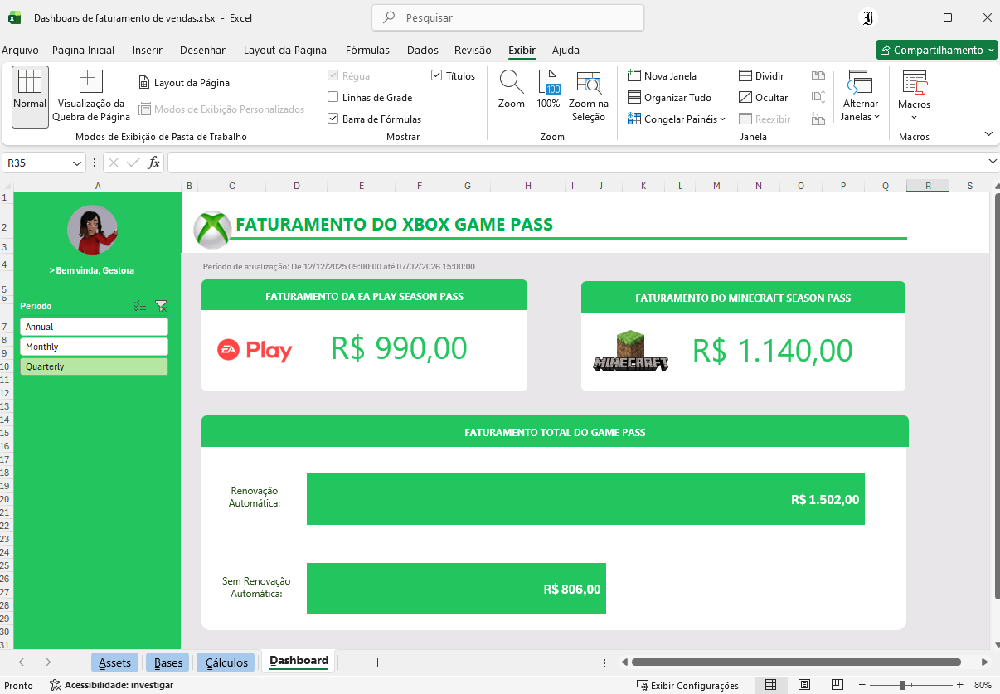

# 📊 Dashboard de Vendas - Xbox Game Pass

Este repositório contém um projeto **didático** desenvolvido em Excel para análise de assinaturas do **Xbox Game Pass**.  
O objetivo é demonstrar como organizar dados, aplicar cálculos e construir dashboards interativos para apoiar decisões de negócio.

---

## 📂 Estrutura do Projeto
- **Dashboars de valores de vendas.xlsx** → arquivo principal com base de dados, cálculos e dashboard.  
- **print.png** → captura de tela do dashboard para visualização rápida.  

---

## 🗂️ Conteúdo do Excel
O arquivo está dividido em seções:

- **Assets** → paleta de cores, ícones e elementos visuais usados no dashboard.  
- **Bases** → dados brutos de assinantes, incluindo:
  - ID, nome, plano (Core, Standard, Ultimate)  
  - Data de início, auto-renovação  
  - Preço da assinatura e tipo (mensal, trimestral, anual)  
  - Passes adicionais (EA Play, Minecraft)  
  - Valores de cupons e total gasto  
- **Cálculos** → tabelas dinâmicas e resumos que respondem perguntas de negócio, como:
  - Faturamento total de planos anuais  
  - Faturamento separado por auto-renovação  
  - Total de vendas de EA Play Season Pass  
  - Total de vendas de Minecraft Season Pass  
- **Dashboard** → visualização consolidada dos dados, com gráficos e indicadores.

---

## 🎯 Objetivo Didático
Este projeto foi criado para fins educacionais, com foco em:
- Praticar organização e limpeza de dados.  
- Explorar tabelas dinâmicas e segmentações de dados.  
- Construir dashboards visuais e interativos.  

---

## 🖼️ Visualização

---

## 🚀 Como Usar
1. Abra o arquivo `Dashboars de faturamento de vendas.xlsx` no Excel.  
2. Explore as abas de **Bases**, **Cálculos** e **Dashboard**.  
3. Utilize as segmentações de dados para filtrar informações e observar como os gráficos se atualizam.  

---

## 📌 Observações
- Os dados são fictícios e servem apenas para fins de aprendizado.  
- O projeto pode ser expandido com novas métricas, gráficos e relatórios.  

---

## 📖 Licença
Este repositório é de uso **didático** e pode ser livremente utilizado para estudos e práticas em Excel.
